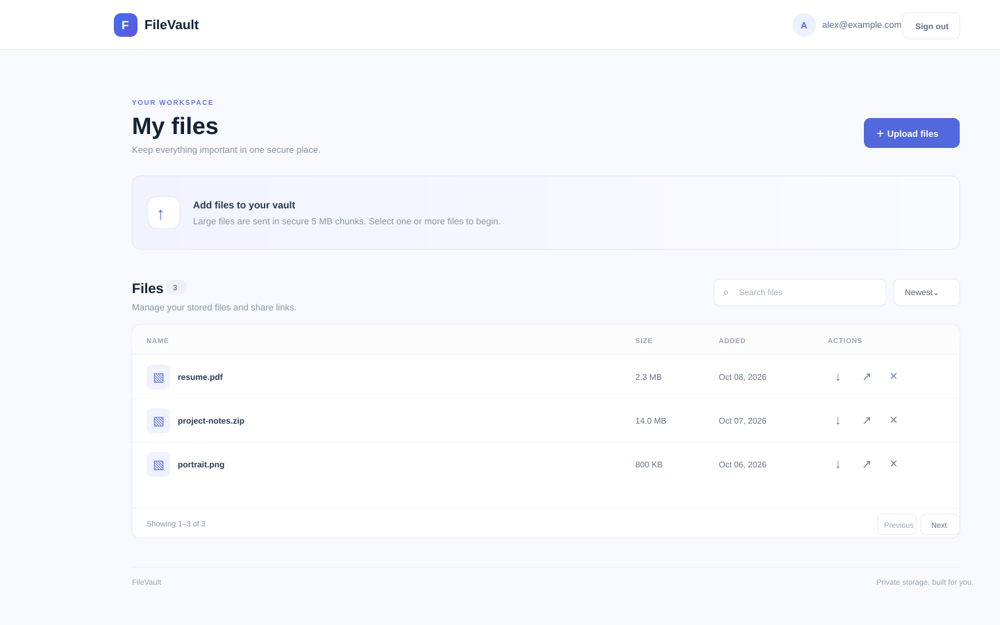

# FileVault

FileVault is a self-hostable file-storage application built with FastAPI,
PostgreSQL, MinIO, and a small React dashboard. Its central learning goal is
the lifecycle of an owned file: authenticate, create an upload session, submit
ordered chunks, assemble and store the object, persist metadata, and list,
download, or delete it.

## 1. FileVault

This README is a study and reference guide to the code that is present today.
It distinguishes implemented behavior from partial behavior and unfinished
work; it is not a claim of production hardening or public-cloud deployment.



## 2. V1 Scope

| Requirement | Current status | What that means in this code |
| --- | --- | --- |
| JWT authentication and authorization | **Implemented** | Bearer tokens protect routes; user identity is resolved by `get_current_user`; private file/session operations check ownership. |
| Password hashing | **Implemented** | Passwords are hashed and verified with Passlib's Argon2 context. |
| Chunked/resumable file uploads | **Partial** | The API persists sessions/chunks and accepts numbered parts. The dashboard does not persist session progress or resume automatically after reload/interruption. |
| Upload-session and chunk tracking | **Implemented, with gaps** | PostgreSQL records sessions and uploaded parts. Sessions have no expiry or abandoned-session cleanup. |
| Chunk validation and assembly | **Partial** | Owner/session state, chunk-number range, and required-part count are checked; parts are assembled in number order. There is no checksum verification, declared-size verification, or robust retry-content comparison. |
| MinIO/S3-compatible object storage | **Implemented** | `MinioStorage` is the active adapter; MinIO stores bytes and creates presigned download URLs. |
| PostgreSQL file metadata | **Implemented** | The database stores names, object keys, byte sizes, content types, status, timestamps, and ownership—not file payloads. |
| File ownership/access control | **Implemented** | File operations are owner-scoped; upload-session access by a different user is reported as not found. |
| Upload/list/get/download/delete operations | **Implemented** | Both direct multipart upload and the chunked workflow exist, plus owner-scoped metadata and file operations. |
| Pagination | **Implemented** | File listing supports page, page size, total count, and total pages; page size is capped at 100. |
| Failed/abandoned upload cleanup | **Not implemented** | Temporary parts are deleted on successful completion, but there is no expiry policy or background/manual cleanup path for abandoned or failed sessions. |
| Service/repository architecture | **Implemented, not perfectly uniform** | Routers, service classes, repository contracts, and PostgreSQL adapters exist. Some account logic lives in `app/service.py`, not the `services/` directory. |
| Storage abstraction | **Partial** | A storage contract and MinIO implementation exist. The filesystem adapter does not implement the full abstract contract (presigned URL generation), so it cannot currently be instantiated as a `storageBackend`. |
| Validation | **Partial** | Pydantic validates request fields and limits; upload logic checks session ownership/state and chunk range. File content, declared file size, and checksums are not comprehensively validated. |
| Alembic migrations | **Implemented** | Versioned schema revisions are applied by the API container before Uvicorn starts. |
| Dockerized environment | **Implemented for local use** | Compose runs PostgreSQL, Redis, MinIO, API, frontend, and edge Nginx with named data volumes. This is not a public-hosting deployment. |
| OpenAPI documentation | **Implemented** | FastAPI exposes OpenAPI JSON and Swagger UI at `/openapi.json` and `/docs`. |
| Environment-based configuration | **Implemented** | Runtime settings are read from environment variables; `.env.example` files are templates, not credentials. |

### Additional V1 work already present

The repository also contains a React dashboard, Redis-backed rate limits,
expiring public share links, Nginx routing, a frontend build, and a GitHub
Actions workflow. These are implemented features, not V2 plans. Important
limitations of sharing and rate limiting are covered below.

## 3. Architecture

FileVault is a **modular monolith**: one FastAPI process serves the API and
coordinates external infrastructure. The frontend is a separate static web
container. PostgreSQL stores relational metadata, MinIO stores file bytes,
and Redis is used for rate-limit counters.

```text
Browser
  ├── React dashboard (HTML/JS/CSS)
  ├── /api/... ────────┐
  └── /share/... ──────┤
                       ▼
                 Edge Nginx
                 ├── /       → frontend Nginx → built React assets
                 ├── /api/*  → FastAPI (strips /api prefix)
                 ├── /share/*→ FastAPI public share route
                 └── /docs, /health → FastAPI
                                 │
                ┌────────────────┼─────────────────┐
                ▼                ▼                 ▼
         PostgreSQL          Redis              MinIO
         accounts,           rate-limit         object bytes,
         metadata,            counters           presigned URLs
         sessions, shares
                ▲                                  ▲
                └── FastAPI returns signed URL ───┘
                         Browser downloads bytes
                         directly from MinIO
```

Within the backend, a request normally follows:

```text
HTTP request
  → Router (`app/routers/`)
  → FastAPI dependencies (`app/dependencies.py`)
  → Service (`app/services/`, or account functions in `app/service.py`)
  → Repository contract → PostgreSQL adapter → PostgreSQL
  → Storage contract → MinIO adapter → MinIO
```

| Layer | Responsibility and files | Why the layer exists | What gets harder if all logic is in a router |
| --- | --- | --- | --- |
| Edge proxy | `nginx/default.conf` | One browser-facing origin; routes UI/API/share paths and sets proxy limits/headers. | Routing, static hosting, and API business logic become coupled. |
| Frontend | `frontend/src/main.jsx`, `frontend/src/styles.css` | Presents login and file-management interactions; calls the HTTP API. | UI state would be mixed into backend code and could not be tested/deployed independently. |
| Router / HTTP boundary | `app/routers/auth.py`, `files.py`, `uploads.py` | Parses HTTP input, requests dependencies, calls logic, and maps expected failures to status codes. | HTTP details, persistence, and storage become one hard-to-test function; provider changes leak into HTTP handling. |
| Dependency wiring | `app/dependencies.py` | Constructs request services, repositories, storage, current-user, and rate-limiter dependencies; tests override providers. | Construction/configuration is duplicated in endpoints and substituting fakes becomes difficult. |
| Service / workflow | `app/services/`, `app/service.py` | Applies business rules and coordinates repositories with storage. | Multi-step flows become difficult to reuse and reason about separately from HTTP. |
| Repository | Interfaces under `app/repositories/`; PostgreSQL implementations alongside them | Encapsulates SQLModel queries and metadata persistence. | SQL queries spread through routers/services and database replacements become more invasive. |
| Storage adapter | `app/storage/base.py`, `minio_storage.py`, `local.py` | Provides an object-storage contract for bytes and signed download URLs. | MinIO-specific calls and object naming spread throughout business logic. |
| Data services | Compose PostgreSQL, Redis, MinIO | Store data in components suited to relational queries, expiring counters, and binary objects. | Large blobs in relational rows or ad hoc local state would make operations and scaling less suitable. |

These boundaries are visible and useful, but they do not make every multi-step
operation atomic. Repository methods commit individually, and PostgreSQL
transactions cannot roll back an already-written MinIO object. See
[Known Limitations / TODO](#17-known-limitations--todo).

### Nginx in this project

There are two distinct Nginx instances:

1. The edge container uses [`nginx/default.conf`](nginx/default.conf). It is
   published at `127.0.0.1:8080`, routes `/api/...` to FastAPI while removing
   `/api/`, routes `/share/...` to FastAPI, and sends the rest to the frontend
   service. It also configures a 1 GiB request-body ceiling, longer API proxy
   timeouts, gzip for eligible text responses, and baseline response headers.
2. The frontend image uses [`frontend/nginx.conf`](frontend/nginx.conf). It
   serves the built static files from `/usr/share/nginx/html`; `try_files`
   falls back to `index.html` so React can render a client-side route.

Nginx does not perform authentication or business authorization. Those checks
are in FastAPI. The 1 GiB Nginx setting is only a per-request proxy ceiling;
it does not guarantee that the API, object store, host disk, and all deployment
timeouts can support a 1 GiB file.

For a deeper proxy walkthrough, see
[Architecture and Code Walkthrough](docs/ARCHITECTURE.md#2-runtime-services-and-network-boundaries).

## 4. Repository Structure

This tree lists the application source and important configuration files
currently present. Generated directories such as `frontend/node_modules/`,
`frontend/dist/`, caches, and local environment files are omitted.

```text
.
├── .env.example
├── .gitignore
├── .github/
│   └── workflows/
│       └── tests.yml
├── app/
│   ├── alembic/
│   │   ├── versions/
│   │   ├── env.py
│   │   ├── README
│   │   └── script.py.mako
│   ├── repositories/
│   ├── routers/
│   ├── services/
│   ├── storage/
│   ├── tests/
│   ├── utils/
│   ├── config.py
│   ├── db.py
│   ├── dependencies.py
│   ├── healthcheck.py
│   ├── main.py
│   ├── models.py
│   ├── schemas.py
│   ├── security.py
│   ├── service.py
│   ├── alembic.ini
│   ├── Dockerfile
│   └── requirements.txt
├── docs/
│   ├── ARCHITECTURE.md
│   └── screenshots/
│       └── dashboard-preview.svg
├── frontend/
│   ├── src/
│   │   ├── main.jsx
│   │   └── styles.css
│   ├── Dockerfile
│   ├── index.html
│   ├── nginx.conf
│   ├── package.json
│   └── vite.config.js
├── nginx/
│   └── default.conf
└── docker-compose.yml
```

### Backend file map

| File or directory | Purpose |
| --- | --- |
| `app/main.py` | Creates the FastAPI app, defines `GET /health`, and mounts the auth, file, upload, and public-share routers. |
| `app/config.py` | Reads database, JWT, MinIO, Redis, rate-limit, and share URL settings from environment variables. |
| `app/db.py` | Creates the SQLModel/SQLAlchemy engine and yields a database `Session` through `get_session()`. |
| `app/models.py` | Defines the `User`, `File`, `UploadSession`, `Chunk`, and `ShareLink` SQLModel tables. |
| `app/schemas.py` | Defines API input/output validation models, including `UploadInitiateRequest`, file responses, and share requests/responses. |
| `app/security.py` | Defines Argon2 password helpers and JWT encode/decode helpers. |
| `app/service.py` | Defines account lookup, registration, and credential authentication functions. |
| `app/dependencies.py` | Wires `get_current_user`, repositories, `MinioStorage`, workflow services, and the cached Redis rate limiter. |
| `app/routers/auth.py` | Registration, login, and current-user handlers. |
| `app/routers/files.py` | File listing/direct upload/metadata/download/delete and share management, plus public share download route. |
| `app/routers/uploads.py` | Upload-session creation, chunk upload, and upload completion handlers. |
| `app/services/upload_session.py` | Creates a session record and generated destination object key. |
| `app/services/chunk_service.py` | Verifies session ownership/state and chunk number; stores and records a part. |
| `app/services/complete_upload.py` | Checks completeness, orders and concatenates parts, writes the final object, creates `File` metadata, and removes parts on success. |
| `app/services/upload.py` | Direct upload, metadata lookup/list/search/count, and file deletion workflow. |
| `app/services/download_service.py` | Checks file existence and owner, then asks storage for a five-minute signed URL. |
| `app/services/share_service.py` | Creates, lists, revokes, and validates expiring/download-limited public links. |
| `app/services/rate_limiter.py` | Uses a Redis Lua script for an atomic increment plus first-use expiry. |
| `app/repositories/*_repository.py` | Abstract persistence contracts for files, sessions, chunks, and share links. `chunk_repositiry.py` has this spelling in the repository. |
| `app/repositories/postgres_*.py` | SQLModel-backed PostgreSQL implementations of those contracts. |
| `app/storage/base.py` | Abstract `storageBackend` contract: `put`, `get`, `delete`, `exists`, and `generate_download_url`. |
| `app/storage/minio_storage.py` | Active MinIO implementation of the storage contract. |
| `app/storage/local.py` | Filesystem storage attempt; it omits `generate_download_url`, so it does not currently satisfy the abstract contract. |
| `app/storage/exceptions.py` | Domain exceptions for storage, ownership, upload, and share errors. |
| `app/utils/object_key.py` | Generates user/date/UUID-based object keys with the filename extension. |
| `app/alembic/env.py` | Loads SQLModel metadata and `DATABASE_URL` for Alembic migration execution/autogeneration. |
| `app/alembic/versions/` | Six revisions: initial user/file tables, file storage metadata, upload sessions, chunks, chunk object-key correction, and share links. |
| `app/tests/conftest.py` | Creates an isolated SQLite database and provides in-memory storage/Redis test doubles and API helpers. |
| `app/tests/test_api.py` | Tests auth, ownership, direct/chunk upload, listing, sharing, rate limits, and signed download naming. |
| `app/healthcheck.py` | Container health probe that requests the API's `/health` endpoint. |
| `app/requirements.txt` | Python dependencies used by the API and test job. |
| `app/Dockerfile` | Builds the Python API image and runs migrations before Uvicorn. |

### Frontend and root files

| File or directory | Purpose |
| --- | --- |
| `frontend/src/main.jsx` | React app, API helper, login/register, dashboard, sequential 5 MiB chunk uploads, progress display, search/sort/pagination, download/delete, and sharing controls. |
| `frontend/src/styles.css` | Dashboard/auth styles and responsive layout. |
| `frontend/index.html` | Vite document entry point and browser metadata. |
| `frontend/vite.config.js` | Vite React plugin configuration. |
| `frontend/package.json` / `package-lock.json` | Frontend scripts, dependency versions, and locked dependency tree. |
| `frontend/Dockerfile` | Multi-stage build: Node/Vite compilation followed by static-file Nginx image. |
| `docker-compose.yml` | Defines PostgreSQL, Redis, MinIO, API, frontend, edge Nginx, health checks, dependencies, ports, and persistent volumes. |
| `nginx/default.conf` | Host-facing reverse-proxy routing and server-level limits/headers. |
| `.env.example`, `app/.env.example` | Placeholder environment templates for Compose and host-run API setup respectively. |
| `.gitignore`, `app/.gitignore` | Exclude actual environment files, uploaded local data, dependencies, bytecode, and test caches. |
| `.github/workflows/tests.yml` | Runs backend tests on Python 3.12/3.14 and builds/audits the frontend. |
| `docs/ARCHITECTURE.md` | Extended architecture, request-flow, deployment-boundary, and code walkthrough. |

## 5. Authentication Flow

Authentication is implemented in `app/routers/auth.py`, `app/security.py`,
`app/service.py`, and `app/dependencies.py`.

1. **Registration input:** `register()` receives a `UserCreate` schema with an
   email and a password constrained to 8–128 characters.
2. **Duplicate check and hash:** `create_user()` looks up the email through
   `get_user_by_email()`. If it exists, it raises HTTP 400. Otherwise,
   `hash_password()` hashes the password with Passlib's Argon2 context.
3. **Persist account:** `create_user()` inserts the `User`, commits, refreshes,
   and returns it. The `UserResponse` response model exposes `id` and `email`,
   not `hashed_password`.
4. **Login request:** `login()` uses FastAPI's
   `OAuth2PasswordRequestForm`, so the body is URL-encoded form data with
   fields named `username` and `password`; `username` carries the email.
5. **Rate limit and verify:** The handler consumes the login/IP Redis limit
   before calling `authenticate_user()`. That function finds the email and
   compares the password with the stored Argon2 hash. Invalid credentials
   return HTTP 401.
6. **Create JWT:** `create_access_token()` copies claims, adds `exp`, and signs
   the token with configured `SECRET_KEY` and `ALGORITHM`. The current subject
   claim is `sub: <user email>`; the expiration is configured by
   `ACCESS_TOKEN_EXPIRE_MINUTES` (default 30 minutes).
7. **Verify bearer token:** Protected routes depend on `get_current_user()`.
   `OAuth2PasswordBearer` extracts the bearer token; the dependency decodes and
   verifies it, reads `sub`, looks up the user, and returns that `User`.
8. **Authorize the action:** Authentication establishes *who* the user is.
   The file/service logic separately verifies *whether* that user owns the
   requested file or upload session. A valid token alone does not grant access
   to another user's files.

```text
POST /auth/register
  → UserCreate validation
  → create_user() → hash_password() → PostgreSQL

POST /auth/login (form username/password)
  → Redis rate limit
  → authenticate_user() → verify_password()
  → create_access_token({sub: email, exp: ...})
  → {access_token, token_type}

Protected request: Authorization: Bearer <token>
  → OAuth2PasswordBearer
  → get_current_user() → decode_access_token() → account lookup
  → endpoint/service checks ownership
```

The browser stores the token in `localStorage` under `filevault-token` in
`frontend/src/main.jsx`. This makes the demo convenient but means an XSS bug
could expose the token; it is not a hardened production session design.
`User.email` also has no database uniqueness constraint in the current model,
so the application-level duplicate check is not race-proof.

## 6. Upload System

The chunked-upload endpoints are in `app/routers/uploads.py`; orchestration
lives in `UploadSessionService`, `ChunkService`, and `CompleteUploadService`.

### Actual chunked upload flow

1. **Client starts an upload:** `POST /uploads/initiate` sends JSON
   `{"filename": "...", "total_chunks": N}`. `UploadInitiateRequest` limits the
   filename to 1–255 characters and chunk count to 1–10,000.
2. **Server creates a session:** `UploadSessionService.initiate_upload()`
   generates a final object key, creates an `UploadSession` in
   `INITIATED` state, and returns its UUID and object key.
3. **Client uploads parts:** For each 1-based part, it sends a multipart form
   field named `file` to
   `POST /uploads/{upload_id}/chunks/{chunk_number}`. The dashboard uses
   sequential 5 MiB slices.
4. **Server validates the part request:** `ChunkService.upload_chunk()`
   confirms that the session exists, belongs to the user, is still
   `INITIATED`, and that the number is within `1..total_chunks`.
5. **Part bytes are stored and tracked:** The service writes bytes to MinIO at
   `uploads/{upload_id}/chunk-{chunk_number}`, creates a `Chunk` row with
   number, byte size, key, and `UPLOADED` status, then increments the
   session's uploaded count.
6. **Client requests completion:** It calls
   `POST /uploads/{upload_id}/complete`.
7. **Server verifies completeness:** `CompleteUploadService.complete_upload()`
   re-checks session ownership/state and compares the number of chunk records
   with `total_chunks`. Missing records produce `UploadIncomplete` and HTTP
   400.
8. **Parts are ordered and assembled:** The service sorts records by
   `chunk_number`, streams each MinIO object into a Python `TemporaryFile`,
   rewinds that file, and writes it to the session's final object key.
9. **Final metadata is saved:** It sums stored chunk sizes and creates a
   `File` row with the session filename/key/owner and
   `application/octet-stream` content type.
10. **Temporary state is removed on success:** It deletes chunk objects and
    rows, marks the session `COMPLETED`, and returns success.

The final assembled file is staged in a temporary file on the API container's
filesystem. It is not concatenated into one in-memory byte string, but
assembly still requires enough temporary disk space for the complete file.

### What the upload concepts mean here

- **Upload session:** Durable database record representing one multi-request
  workflow. Its public `upload_id` is a UUID; internal row ID is an integer.
- **Chunk number:** 1-based ordering key used to associate each part and
  restore original byte order.
- **Total chunks:** Client-provided expected part count. Completion compares
  this with the number of persisted chunk rows.
- **Object key:** Internal storage path generated independently of the user's
  original filename. `ObjectkeyGenerator.generate()` uses the user ID, date,
  UUID, and filename extension.
- **Upload status:** Session currently uses `INITIATED` and `COMPLETED`;
  chunks are written as `UPLOADED`; completed files default to `READY`.
- **Chunk storage:** Each part is an individual MinIO object until successful
  assembly, then it is deleted.
- **Final file metadata:** PostgreSQL keeps the visible filename, size,
  content type, owner, status, timestamp, and MinIO object key. It does not
  keep the file's bytes.

Chunking breaks a large transfer into smaller requests. That can make progress
visible and lets the API validate/store each part independently, instead of
requiring one huge multipart request. In this code, however, chunking is not
the same as complete resumability: the server has no endpoint to query upload
progress, and the browser does not persist the upload ID/progress across
reloads. The service returns an existing chunk record for a repeated number,
but it does not compare the retry's bytes with the previously stored bytes.

## 7. Deep Dive: Upload Code

### Initiate: `POST /uploads/initiate`

```text
uploads.initiate_upload()
  → get_current_user()
  → get_upload_session_service()
  → RateLimiter.consume("upload-initiate", user_id, ...)
  → UploadSessionService.initiate_upload()
  → PostgresUploadSessionRepository.create()
  → PostgreSQL
```

- `initiate_upload()` receives validated `UploadInitiateRequest`, the
  authenticated `User`, an `UploadSessionService`, and a `RateLimiter`.
- It limits initiation by user, maps rate-limit errors to 429/503, then calls
  the service with owner ID, filename, and expected part count.
- `UploadSessionService.initiate_upload()` creates a random destination key
  and `UploadSession`, then asks the repository to persist it.
- `PostgresUploadSessionRepository.create()` adds, commits, refreshes, and
  returns the model. The router returns `upload_id` and `object_key`.

### Store one part: `POST /uploads/{upload_id}/chunks/{chunk_number}`

```text
uploads.upload_chunk()
  → get_current_user(), get_chunk_service(), get_rate_limiter()
  → RateLimiter.consume("upload-chunk", user_id, ...)
  → ChunkService.upload_chunk()
     ├── UploadSessionRepository.get_by_upload_id()
     ├── ChunkRepository.get_chunk()
     ├── storageBackend.put()
     ├── ChunkRepository.create()
     └── UploadSessionRepository.update()
```

- The handler receives a UUID, integer chunk number, and multipart `UploadFile`.
  It rate-limits chunks per user and translates session/range/storage failures
  to HTTP errors.
- `ChunkService.upload_chunk()` checks the owner, session status, number range,
  and whether a row for that session/number already exists.
- For a new part, it measures stream length, writes the part to storage, saves
  a `Chunk`, increments `uploaded_chunks`, and updates the session.
- The repository writes are separate commits. If a later step fails after an
  object write, the workflow may leave an object without matching metadata.

### Complete: `POST /uploads/{upload_id}/complete`

```text
uploads.complete_upload()
  → get_current_user(), get_complete_upload_service()
  → CompleteUploadService.complete_upload()
     ├── UploadSessionRepository.get_by_upload_id()
     ├── ChunkRepository.list_chunk()
     ├── storageBackend.get() for each ordered part
     ├── storageBackend.put() for the final object
     ├── FileRepository.create()
     ├── storageBackend.delete() and ChunkRepository.delete()
     └── UploadSessionRepository.update(status="COMPLETED")
```

- `complete_upload()` receives the upload UUID and current owner. It does not
  receive file bytes; bytes were transferred in earlier chunk requests.
- The service rejects a missing, foreign, or non-`INITIATED` session; then
  verifies all expected chunk rows exist.
- It orders by chunk number, builds the temporary assembled stream, stores the
  final object, persists file metadata, deletes part objects/rows, and updates
  the status.
- Its current response is a simple success message. The client refreshes the
  file list to obtain the new file record.
- This workflow coordinates MinIO and multiple database commits without a
  distributed transaction. Cleanup occurs on the success path; failure paths
  can leave orphaned objects/rows for which no cleanup job exists.

### Direct-upload path

`POST /files/upload` calls `UploadServices.upload()` rather than the
multi-request flow. It creates a key, writes the incoming multipart file to
storage, constructs a `File` row, and calls `FileRepsitory.create()`. If an
exception occurs it attempts to remove the object if storage reports it
exists, then re-raises. This endpoint is useful for simpler uploads but does
not provide chunk-level progress/recovery.

## 8. Storage Abstraction

`app/storage/base.py` defines the abstract `storageBackend` contract:

```python
put(key, data) -> None
get(key) -> BinaryIO
delete(key) -> None
exists(key) -> bool
generate_download_url(key, expires_in, filename=None) -> str
```

The service layer depends on that contract rather than importing MinIO
operations directly. This makes services easier to test with `MemoryStorage`
and is intended to make a provider replaceable without rewriting upload
business rules.

- **`MinioStorage`** in `app/storage/minio_storage.py` is the active adapter,
  selected by `get_storage()` in `app/dependencies.py`. It writes/reads/removes
  objects, checks existence, and generates presigned GET URLs. It can use an
  internal MinIO endpoint for server operations and a public endpoint for
  links followed by the browser.
- **`LocalStrorage`** in `app/storage/local.py` copies streams to/from a
  filesystem root and supports basic put/get/delete/exists operations. It
  currently omits the abstract `generate_download_url()` method. Because
  Python's ABC prevents instantiating a class with an unimplemented abstract
  method, this class is not a drop-in working replacement.

Therefore, the abstraction is a useful design boundary, but provider switching
is currently theoretical: a second adapter must implement the entire contract,
be wired in `get_storage()`, and be tested for download URL behavior and
failure semantics. Download URLs are provider-specific, so they are part of
the contract rather than an incidental detail.

## 9. Database Design

The table models are defined in `app/models.py`; migrations under
`app/alembic/versions/` define their deployed schema.

```text
User (id PK)
  ├── File (owner_id FK → User.id)
  │     └── ShareLink (file_id FK → File.id, owner_id FK → User.id)
  └── UploadSession (owner_id FK → User.id)
          └── Chunk (UploadSession_id FK → UploadSession.id)
```

The arrows above describe foreign-key intent. The ORM explicitly declares a
`User.files` / `File.owner` relationship; it does not define ORM relationships
between `UploadSession` and `Chunk`.

| Model/table | Important columns and constraints |
| --- | --- |
| `User` / `user` | Integer primary key; email; Argon2 hash; UTC creation timestamp. The current schema does not mark email unique or indexed. |
| `File` / `file` | Integer primary key; original filename; unique/indexed `object_key`; size; content type; `READY` status by default; creation timestamp; `owner_id` foreign key to `user.id`. |
| `UploadSession` / `uploadsession` | Integer primary key; indexed UUID `upload_id`; filename; final object key; owner FK; `INITIATED` status; total/uploaded chunk counts; creation timestamp. Migration's upload ID index is not declared unique. |
| `Chunk` / `chunk` | Integer primary key; `UploadSession_id` FK; 1-based number; byte size; temporary object key; optional checksum; `UPLOADED` status; timestamp. The code does not calculate/use a checksum, and the schema has no unique constraint on session+chunk number. |
| `ShareLink` / `sharelink` | Integer primary key; unique/indexed SHA-256 token hash; file and owner FKs (cascade on deletion); expiration; count; optional max; revoked flag; timestamp. File and owner foreign-key columns are indexed. |

Primary keys identify rows; foreign keys connect records and enforce references.
Indexes speed selected lookups: object key, upload UUID, share token hash, and
share owner/file. The migration history is the source of truth for actual DB
constraints; model declarations and migrations should be kept aligned.

PostgreSQL is suited to searchable/filterable ownership metadata and relational
references. Large file bodies are stored in MinIO, where object keys identify
the bytes. PostgreSQL then stores the key and descriptive metadata instead of
making every listing query work with a large binary column.

Repository methods commonly call `commit()` individually. There is no single
transaction spanning object storage plus all metadata writes in a full upload;
object storage cannot participate in the PostgreSQL transaction. That makes
failure compensation/cleanup important future work.

## 10. Alembic

Alembic tracks schema changes as ordered Python revision scripts. In this
project, `app/alembic/env.py` imports SQLModel metadata and reads
`DATABASE_URL`; `app/alembic/versions/` contains the revisions. The API
container's Docker command runs `alembic upgrade head` before starting Uvicorn.

When modifying a model, generate a candidate migration, inspect and edit it,
then apply and test it. Autogeneration is a draft, not a substitute for review.
Run commands from `app/` (or through `docker compose exec api` from the repo
root):

```sh
# Show the current migration revision (inside the running API container).
docker compose exec api alembic current

# Apply all revisions through the latest one.
docker compose exec api alembic upgrade head

# Generate a migration after updating app/models.py and rebuilding the image.
docker compose exec api alembic revision --autogenerate -m "describe schema change"

# Roll back one revision in the local database.
docker compose exec api alembic downgrade -1
```

For host-run Python (when separately provisioned services and
`app/.env`/`DATABASE_URL` are available), the corresponding commands are:

```sh
cd app
alembic current
alembic upgrade head
alembic revision --autogenerate -m "describe schema change"
alembic downgrade -1
```

Do not expect a rollback to reverse stored object changes: Alembic manages the
database schema only.

## 11. API Reference

FastAPI's internal paths are listed below. The browser-facing edge proxy
accepts `/api/...` and strips `/api/`; it also has direct routing for private
`/auth`, `/files`, and `/uploads` paths. Public sharing is `/share/...`.
Protected endpoints require `Authorization: Bearer <JWT>`. Missing/invalid
credentials normally return 401; invalid request shapes and path/query
constraints normally return 422.

| Method + path | Auth? | Request | Success response | Implemented errors |
| --- | --- | --- | --- | --- |
| `POST /auth/register` | No | JSON `{"email":"...","password":"..."}`; password length 8–128. | 200 `{"id": ..., "email": ...}` | 400 email already registered; 422 validation. |
| `POST /auth/login` | No | URL-encoded form fields `username` (email) and `password`. | 200 `{"access_token":"...", "token_type":"bearer"}` | 401 invalid credentials/token context; 429 rate limit + `Retry-After`; 503 Redis unavailable. |
| `GET /auth/me` | Yes | Bearer token. | 200 `{"id": ..., "email": ...}` | 401 invalid/expired token or unknown user. |
| `GET /files/` | Yes | Query: `page` (default 1), `page_size` (default 20, 1–100), `search` (max 255), `sort_by` (`filename`, `size`, `created_at`), `sort_order` (`asc`, `desc`). Optional `file_id` query switches to a single metadata result. | List: `items`, page fields, total, total_pages. With `file_id`: file detail. | 401; 403/404 for `file_id`; 422 invalid query. |
| `POST /files/upload` | Yes | Multipart field `file`. | 200 `{"message":"file uploaded","id":...}` | 401; 422 missing/invalid form; 503 storage unavailable. |
| `GET /files/{file_id}` | Yes | Integer path ID. | 200 `id`, `filename`, `size`, `content_type`, `status`, `created_at`, `object_key`, `owner_id`. | 401, 403, 404, 422. |
| `GET /files/{file_id}/download` | Yes | Integer path ID. | 200 `{"url":"<signed URL>","expires_in":300}` | 401, 403, 404, 503 storage unavailable. |
| `DELETE /files/{file_id}` | Yes | Integer path ID. | 200 `{"message":"File deleted"}` | 401, 403, 404, 503 storage unavailable. |
| `POST /uploads/initiate` | Yes | JSON `{"filename":"...","total_chunks":N}`; filename 1–255; chunks 1–10,000. | 200 `{"upload_id":"<UUID>","object_key":"..."}` | 401, 422, 429 + `Retry-After`, 503 Redis unavailable. |
| `POST /uploads/{upload_id}/chunks/{chunk_number}` | Yes | UUID, 1-based integer number, multipart field `file`. | 200 message and saved `chunk_number`. | 401, 400 out-of-range chunk, 404 missing/foreign/inactive session, 422 malformed input, 429 + `Retry-After`, 503 storage/Redis unavailable. |
| `POST /uploads/{upload_id}/complete` | Yes | UUID path; empty body. | 200 `{"message":"upload completed successfully"}` | 401, 400 missing chunks, 404 missing/foreign/inactive session, 503 storage unavailable. |
| `POST /files/{file_id}/share` | Yes | JSON `expires_in_hours` (default 24, 1–720), optional `max_downloads` (1–10,000). | 201 share ID, one-time `share_url`, expiration, count/limit, revoked. | 401, 403, 404, 422. |
| `GET /files/{file_id}/shares` | Yes | File ID path. | 200 array of share state; `share_url` is `null`. | 401, 403, 404. |
| `DELETE /files/{file_id}/share/{share_id}` | Yes | File and share IDs. | 200 share state with `share_url: null`. | 401, 404 (including not owned/not matching share). |
| `GET /share/{token}` | No | Bearer capability token in path. | 307 redirect to a five-minute MinIO signed URL. | 404 invalid/revoked/missing file; 410 expired or download limit reached; 503 storage unavailable. |
| `GET /health` | No | None. | 200 `{"status":"ok"}`. | No application-specific error mapping. |

The exact route definitions and exception mapping are in
[`app/routers/auth.py`](app/routers/auth.py),
[`app/routers/files.py`](app/routers/files.py), and
[`app/routers/uploads.py`](app/routers/uploads.py). FastAPI publishes the
interactive schema at `/docs`.

## 12. Running FileVault

### Recommended: Docker Compose

This is the environment actually wired end-to-end in the repository. It
includes PostgreSQL, Redis, MinIO, FastAPI, the frontend, and edge Nginx.
Requirements: Docker Engine with the Compose plugin (or compatible Compose),
OpenSSL for generating local secrets, and free host ports 8080, 9000, and
9001.

1. From the repository root, create the ignored local environment file:

   ```sh
   cp .env.example .env
   ```

2. Generate three different random values with `openssl rand -hex 32` and set
   `POSTGRES_PASSWORD`, `MINIO_ROOT_PASSWORD`, and `SECRET_KEY` in `.env`.
   Set a unique `MINIO_ROOT_USER` as well. Do not reuse real/personal
   passwords or commit `.env`. `docker-compose.yml` rejects missing required
   values.

3. Start just the dependency containers if inspecting the infrastructure:

   ```sh
   docker compose up -d postgres redis minio
   ```

   PostgreSQL and Redis are not published to host ports; they are intended for
   other Compose services on the private network. MinIO's S3 API and console
   are loopback-bound to `127.0.0.1:9000` and `127.0.0.1:9001`.

4. Start the complete application (the standard workflow):

   ```sh
   docker compose up --build
   ```

   The API image's startup command runs `alembic upgrade head` and then
   Uvicorn. Compose health checks gate API/frontend/edge startup. Open
   <http://localhost:8080> for the dashboard and
   <http://localhost:8080/docs> for Swagger.

5. Verify migration state or apply migrations explicitly:

   ```sh
   docker compose exec api alembic current
   docker compose exec api alembic upgrade head
   ```

6. Run backend tests on the host (Python and dependencies required):

   ```sh
   cd app
   python -m pytest
   ```

   The tests use an in-memory SQLite database and fake storage/Redis; they do
   not need the Compose services to be running.

7. Run the frontend checks used by the CI workflow:

   ```sh
   npm ci --prefix frontend
   npm run build --prefix frontend
   npm audit --prefix frontend --omit=dev
   ```

Stop with `Ctrl+C` or in another terminal run `docker compose down`. Named
volumes preserve PostgreSQL, Redis, and MinIO data. **`docker compose down -v`
deletes those local volumes and their data.**

### Python environment and host-run API

For Python tooling/tests, create and activate a virtual environment, then
install the repository's backend requirements:

```sh
cd app
python3 -m venv .venv
source .venv/bin/activate
python -m pip install -r requirements.txt
python -m pytest
```

The test suite can run this way because its fixtures configure test settings
and override infrastructure. To run Uvicorn on the host, you must separately
provide reachable PostgreSQL, Redis, and MinIO endpoints and configure
`app/.env` from `app/.env.example`; apply migrations with
`alembic upgrade head`, then run `uvicorn main:app --reload`. **The supplied Compose file does
not publish PostgreSQL or Redis host ports**, so its services are not directly
reachable by a host-run API without changing network setup. The complete
supported local application workflow is Compose.

### Configuration and local data safety

- Root `.env` is used by Compose. `app/.env.example` is a template for a
  separately configured host-run API.
- Local `.env` files are ignored by Git; examples contain no working secrets.
  Environment files are not encrypted—restrict local file access and use a
  secret manager for real deployments.
- Compose host bindings for Nginx and MinIO use loopback. PostgreSQL, Redis,
  API, and frontend are internal Compose services.
- `postgres_data`, `redis_data`, and `minio_data` are named persistent
  volumes. Local filesystem storage data, if used, goes under ignored
  `app/storage_data/`.
- The signed MinIO URLs must contain an address the browser can reach. Local
  Compose uses a browser-facing MinIO endpoint at `localhost:9000`; this
  configuration is not remote/cross-device hosting.
- React currently stores JWT in browser local storage. Avoid using real
  credentials or private files in a public demo.

Important settings are read in `app/config.py`; Compose supplies internal
service addresses to the API. The root template is for Compose and
`app/.env.example` is for a separately configured host-run API.

| Setting | Used for | Current default/source |
| --- | --- | --- |
| `POSTGRES_USER`, `POSTGRES_PASSWORD` | Compose PostgreSQL account and API database URL | User defaults to `filevault`; password is required. |
| `MINIO_ROOT_USER`, `MINIO_ROOT_PASSWORD` | Compose MinIO account and API storage credentials | Required in root `.env`. |
| `DATABASE_URL` | SQLModel/Alembic PostgreSQL connection | Compose constructs it using `postgres:5432`; host-run template uses localhost. |
| `SECRET_KEY`, `ALGORITHM`, `ACCESS_TOKEN_EXPIRE_MINUTES` | JWT signing and expiry | Algorithm defaults to `HS256`; token lifetime defaults to 30 minutes. |
| `MINIO_ENDPOINT`, `MINIO_PUBLIC_ENDPOINT`, `MINIO_BUCKET`, `MINIO_REGION`, `MINIO_SECURE` | Server-side MinIO operations and browser-facing presigning | Compose uses `minio:9000` internally and `localhost:9000` for browser downloads; region defaults to `us-east-1`. |
| `REDIS_URL` | Rate-limit counter store | Compose uses `redis://redis:6379/0`. |
| `LOGIN_RATE_LIMIT`, `UPLOAD_RATE_LIMIT`, `CHUNK_RATE_LIMIT` | Per-minute login-IP, upload-initiation-user, and chunk-user limits | Defaults are 10, 10, and 120. |
| `SHARE_PUBLIC_BASE_URL` | Origin embedded in newly created share links | Compose defaults to `http://localhost:8080`. |

## 13. Example End-to-End Workflow

The commands below use the API routes directly through local edge Nginx. They
assume Compose is running at `http://localhost:8080`, `curl` is installed, and
you replace placeholder values with values returned by prior calls. Do not
paste real passwords into shell history.

```sh
BASE=http://localhost:8080

# 1. Register. Response includes id and email.
curl -i "$BASE/api/auth/register" \
  -H 'Content-Type: application/json' \
  -d '{"email":"learner@example.com","password":"replace-with-a-local-password"}'

# 2. Login uses form fields named username/password; copy access_token
#    from the JSON response into TOKEN.
curl -i "$BASE/api/auth/login" \
  -H 'Content-Type: application/x-www-form-urlencoded' \
  --data-urlencode 'username=learner@example.com' \
  --data-urlencode 'password=replace-with-a-local-password'
TOKEN='<access_token from login response>'

# 3. Create one-part chunked upload session.
curl -i "$BASE/api/uploads/initiate" \
  -H "Authorization: Bearer $TOKEN" \
  -H 'Content-Type: application/json' \
  -d '{"filename":"sample.txt","total_chunks":1}'
UPLOAD_ID='<upload_id from response>'

# 4. Upload the only chunk (repeat with numbers 1..N for a multi-part file).
printf 'FileVault upload example\n' > sample.txt
curl -i "$BASE/api/uploads/$UPLOAD_ID/chunks/1" \
  -H "Authorization: Bearer $TOKEN" \
  -F 'file=@sample.txt'

# 5. Finalize and create the File metadata row.
curl -i -X POST "$BASE/api/uploads/$UPLOAD_ID/complete" \
  -H "Authorization: Bearer $TOKEN"

# 6. List the authenticated user's files.
curl -i "$BASE/api/files/?page=1&page_size=20" \
  -H "Authorization: Bearer $TOKEN"
FILE_ID='<id from the file-list item>'

# 7. Ask for a short-lived URL, then fetch the bytes directly from MinIO.
curl -sS "$BASE/api/files/$FILE_ID/download" \
  -H "Authorization: Bearer $TOKEN"
DOWNLOAD_URL='<url from download response>'
curl -L "$DOWNLOAD_URL" -o downloaded-sample.txt

# 8. Delete the file and its object.
curl -i -X DELETE "$BASE/api/files/$FILE_ID" \
  -H "Authorization: Bearer $TOKEN"
```

Registration/login and this simple upload can also be performed in the
dashboard. A public share flow is: authenticated `POST
/api/files/{file_id}/share`, copy its one-time URL, then open the returned
`/share/{token}` URL without a JWT. Do not follow redirects in a test if you
want to inspect the 307 response rather than download the object.

## 14. Important Backend Concepts I Should Learn

Each row gives a short explanation, where to inspect it, why FileVault uses
it, and an interview prompt to practice.

| Concept | Explanation, FileVault location, and why it matters | Interview practice |
| --- | --- | --- |
| FastAPI dependency injection | `Depends(...)` in `app/routers/` and providers in `app/dependencies.py` inject users, sessions, services, and limiters. It centralizes construction and makes test overrides possible. | What is a dependency scope? How does `app.dependency_overrides` help testing? |
| JWT authentication | `security.create_access_token()` signs claims; `decode_access_token()` verifies signature/expiration; `get_current_user()` resolves `sub`. It gives stateless bearer authentication. | What does a signature prove? Where is expiry checked? What data should not go in a JWT? |
| Authentication vs authorization | `get_current_user()` identifies a caller; owner checks in file services/routes decide if that caller may act on the resource. | Can a valid JWT access every file? Where should an ownership check live? |
| Password hashing | `hash_password()` / `verify_password()` in `app/security.py` use Argon2 rather than storing plaintext or reversible encryption. | Why use a password hash rather than encryption? What do salt and work factor do? |
| Service layer | `ChunkService`, `CompleteUploadService`, `DownloadService`, and `ShareService` coordinate business workflows outside HTTP handlers. | What belongs in a service instead of a router? How would you unit-test a service? |
| Repository pattern | Abstract contracts and PostgreSQL adapters in `app/repositories/` isolate query/persistence details. Tests substitute SQLite-backed dependencies. | What is the benefit and cost of a repository abstraction? Is every ORM wrapper automatically useful? |
| Storage abstraction | `storageBackend` in `app/storage/base.py` describes object operations; `MinioStorage` implements it. It reduces provider coupling, though `LocalStrorage` is currently incomplete. | Which method prevents this adapter from being instantiated? Why is a signed URL part of the interface? |
| PostgreSQL relationships | `File.owner_id`, `UploadSession.owner_id`, `Chunk.UploadSession_id`, and share foreign keys link rows. They enforce referential integrity and model ownership. | What does a foreign key guarantee? Why are ORM relationships different from foreign keys? |
| Transactions | Repository writes commit independently. A DB transaction can group SQL writes but cannot atomically include MinIO operations. | What inconsistency can occur if object upload succeeds but DB insert fails? How might you compensate? |
| Database migrations | `app/alembic/env.py` connects SQLModel metadata; revisions make schema evolution repeatable. | Why not call `create_all()` in production? Why review autogenerate output? |
| Chunked uploads | `UploadSession`, `Chunk`, and upload services store/order parts and assemble them. The dashboard uses 5 MiB chunks. | Why use chunks? How do you know when all expected parts arrived? |
| Resumable uploads | True recovery needs durable client session state and a status/reconciliation API. FileVault persists server records, but the UI does not resume after reload. | What state must the client save? How should retrying the same part be validated? |
| Object storage | MinIO stores file bytes by object key; PostgreSQL stores searchable metadata. This separates blob I/O from relational queries. | Why avoid storing large blobs in a normal metadata table? How are keys different from filenames? |
| S3 concepts | MinIO exposes an S3-compatible object API; FileVault uses object keys and presigned GETs. A presigned URL grants time-limited access to an operation. | What is an object key? What happens when a signed URL expires? |
| MinIO | `app/storage/minio_storage.py` configures the MinIO client, bucket, object operations, and signed URL. The browser uses the configured public endpoint for downloads. | Why must the browser-facing URL differ from an internal Compose hostname? |
| Idempotency | Repeated chunk number currently returns the saved row, but does not compare payload bytes or use a client idempotency key. This is partial retry behavior, not strong idempotency. | What makes an operation idempotent? How would you reject a conflicting retry? |
| Validation | `app/schemas.py` constrains email/password, filenames, counts, page sizes, sort options, and share settings; services validate ownership and chunk range. | Which validation belongs at the API boundary and which is business validation? |
| Pagination | `PostgresFileRepository.list_by_owner()` applies offset/limit; `count_by_owner()` supplies totals; the route calculates total pages. | What are offset pagination's scaling/consistency drawbacks? What is cursor pagination? |
| Error handling | Routers map known domain exceptions to HTTP 4xx/5xx. For example incomplete uploads become 400 and storage outages 503. | Why translate domain errors at the HTTP boundary? What should clients see versus logs? |
| Docker networking | Compose services resolve one another by service names (`api`, `postgres`, `redis`, `minio`); only selected ports are host-published. | Why does `localhost` mean different things inside a container and on the host? |
| Environment configuration | `app/config.py` reads environment values; Compose injects service-specific addresses and secrets. The examples document names without containing credentials. | Why separate config from code? Where should production secrets live? |
| Redis rate limiting | `RateLimiter.consume()` runs an atomic increment/expiry Lua script; endpoint scopes/identities use configured per-minute limits. | Why use a Lua script instead of separate `INCR` and `EXPIRE` calls? What is the fail-open/fail-closed tradeoff? |
| Presigned downloads | `DownloadService` checks ownership, then asks MinIO for a five-minute URL with a filename disposition. Bytes bypass FastAPI. | What are the availability and security tradeoffs of direct-to-object-store downloads? |

## 15. Read This Code In This Order

1. [`app/main.py`](app/main.py) — see the app and which routers are mounted.
2. [`app/routers/auth.py`](app/routers/auth.py) and
   [`app/routers/files.py`](app/routers/files.py) — learn HTTP inputs,
   dependencies, response models, and error translation.
3. [`app/schemas.py`](app/schemas.py) — inspect request constraints and output
   shapes.
4. [`app/dependencies.py`](app/dependencies.py) — follow how a request gets a
   DB session, user, repository, storage adapter, and service.
5. [`app/services/upload_session.py`](app/services/upload_session.py),
   [`app/services/chunk_service.py`](app/services/chunk_service.py), and
   [`app/services/complete_upload.py`](app/services/complete_upload.py) —
   trace the main V1 workflow.
6. [`app/repositories/`](app/repositories/) — compare interfaces and concrete
   PostgreSQL query implementations.
7. [`app/models.py`](app/models.py) — connect service objects to persisted
   tables and foreign keys.
8. [`app/storage/base.py`](app/storage/base.py) and
   [`app/storage/minio_storage.py`](app/storage/minio_storage.py) — trace
   object writes, reads, deletes, and presigned URLs.
9. [`app/security.py`](app/security.py) and
   [`app/service.py`](app/service.py) — follow password/JWT and account
   operations.
10. [`app/alembic/`](app/alembic/) — compare the schema model with migration
    history.
11. [`app/tests/test_api.py`](app/tests/test_api.py) and
    [`app/tests/conftest.py`](app/tests/conftest.py) — see observable
    behavior, fakes, and uncovered edges.
12. [`frontend/src/main.jsx`](frontend/src/main.jsx) — follow actual browser
    calls and why the dashboard currently cannot resume after a reload.
13. [`docker-compose.yml`](docker-compose.yml),
    [`app/Dockerfile`](app/Dockerfile),
    [`frontend/Dockerfile`](frontend/Dockerfile), and
    [`nginx/default.conf`](nginx/default.conf) — understand how the pieces run
    together.

## 16. Interview Questions

Use these to explain the implementation and its tradeoffs, not just recite
definitions.

### FastAPI

**Q: How does an endpoint get a database session and authenticated user?**

A: Through `Depends`: `get_session()` yields a SQLModel session, while
`get_current_user()` depends on the bearer-token scheme and session. FastAPI
resolves these before calling the route.

**Q: Why keep routers thin?**

A: Routers own HTTP-specific parsing and status codes; services can express
workflow rules without an HTTP request object and are simpler to exercise with
test doubles.

### Authentication

**Q: What is in FileVault's JWT?**

A: The current token has `sub` set to the user's email and an `exp` claim.
It is signed with configured key/algorithm; decoding verifies it and the
dependency resolves that subject to a database user.

**Q: Is authentication enough to authorize a file request?**

A: No. The caller can be valid but not own a target file. The file owner ID
must also match; download service and file handlers enforce that condition.

### PostgreSQL and SQLModel

**Q: Why store a MinIO key in PostgreSQL instead of the file bytes?**

A: Listing/search/ownership need relational metadata; object storage handles
the large byte stream. The key joins the metadata row to the object.

**Q: What schema protections are missing or worth checking?**

A: Email is not unique in the current model/migration, and chunks lack a
database uniqueness constraint on `(UploadSession_id, chunk_number)`. Adding
constraints requires a migration and handling existing duplicates.

### Alembic

**Q: What is a migration revision?**

A: A versioned `upgrade()`/`downgrade()` script describing a schema transition.
Alembic records the applied revision in its version table and orders revisions
through `down_revision`.

**Q: Does `--autogenerate` safely write the final migration?**

A: It produces a comparison-based draft. Defaults, nullability, data
backfills, renames, and provider-specific behavior need human review.

### File uploads

**Q: How does FileVault preserve part ordering?**

A: Each `Chunk` stores `chunk_number`; completion sorts records by that number
before copying each MinIO object into the assembled temporary file.

**Q: Is the upload resumable?**

A: Part records survive requests and repeated numbers return the saved record,
but the UI does not persist the session or query server-side progress after a
reload. It is chunked with limited retry behavior, not end-to-end resumable.

**Q: What happens when a part is missing?**

A: Completion compares stored chunk-record count to `total_chunks`; if they
differ, it raises `UploadIncomplete`, mapped to HTTP 400.

### MinIO / S3

**Q: Why does the API return a signed URL rather than stream every download?**

A: It delegates byte transfer to MinIO, reducing FastAPI's bandwidth/load.
The URL grants time-limited access and must point to a host the browser can
reach.

**Q: Does revoking a share invalidate a URL already issued?**

A: No. Revocation blocks later requests through the share endpoint; a
previously issued five-minute MinIO URL can remain valid until expiry.

### Architecture

**Q: What does the repository pattern isolate?**

A: SQL query and persistence details. Services depend on contracts, while the
PostgreSQL implementations translate those calls to SQLModel queries.

**Q: Is the upload atomic across storage and SQL?**

A: No. The code writes MinIO objects and commits database steps separately.
Failure between operations can leave orphaned or inconsistent state; cleanup
and compensation are incomplete.

### Docker

**Q: Why does API code use `postgres:5432` rather than `localhost:5432`?**

A: In a container, `localhost` is that same container. Compose DNS resolves
the PostgreSQL service name across the private network.

**Q: Which services are reachable from the host?**

A: Edge Nginx is bound to loopback port 8080 and MinIO to loopback 9000/9001.
PostgreSQL and Redis have no host port mapping in the supplied Compose file.

### Security

**Q: Where is the raw password stored?**

A: It should not be stored; registration hashes it with Argon2 and only
`hashed_password` is persisted.

**Q: What is a bearer share token?**

A: Possession of the high-entropy token authorizes a public download, so it
must be treated like a secret. The DB stores its SHA-256 hash, but the URL can
be copied or logged by whoever receives it.

**Q: Is this ready to expose publicly?**

A: No. Compose is local-first and lacks production TLS/secret management,
complete cleanup, comprehensive upload integrity checks, operational
monitoring, backup/restore, and a full deployment security review. The browser
also stores JWT in local storage.

### Failure handling

**Q: What if Redis is unavailable?**

A: The limiter converts Redis errors to `RuntimeError`; login and upload
handlers return 503 rather than bypassing rate limiting.

**Q: What if MinIO fails during chunk completion?**

A: Storage errors are mapped to 503, but already-written chunks or final
objects may remain. There is no abandoned-upload cleanup worker or
cross-resource transaction.

## 17. Known Limitations / TODO

### V1 remaining work

- Implement expiry and cleanup for incomplete/abandoned upload sessions and
  orphaned chunk objects; define a safe retention period.
- Make uploads resumable end-to-end: provide progress/status reconciliation,
  persist upload ID/client progress, and handle interrupted sessions.
- Verify chunk integrity and expected content/size; calculate and compare
  checksums rather than merely carrying an optional checksum column.
- Make retries safe by detecting a repeated chunk number with conflicting
  bytes; add database uniqueness constraints for email and session/chunk
  number after planning a data migration.
- Design failure compensation around MinIO writes and individual SQL commits;
  add tests for failure at each workflow step.
- Complete a second storage adapter, including `generate_download_url()`, or
  remove/clearly mark the unusable filesystem adapter.
- Improve production operations: TLS, least-privilege service credentials,
  backups/restore, upload quotas, structured logs/monitoring, and secure
  browser session storage before public deployment.

### V2 ideas (not currently implemented)

- User-to-user permission sharing beyond bearer links.
- Background workers for asynchronous processing; Kafka/event streaming.
- WebSocket-based live updates.
- Virus scanning, content policy, versioning, and storage lifecycle tiers.
- Multi-region/cloud deployment automation and advanced observability.

**Not V2 ideas because they already exist in this repository:** Redis
rate-limiting, Nginx routing, Docker Compose, React dashboard, share links, and
the current CI workflow. They can be improved, but do not need to be described
as future features.

## 18. Resume Description

Use only the claims that match the code you can explain:

- Built a FastAPI file-storage API with JWT authentication, Argon2 password
  hashing, owner-scoped operations, SQLModel/PostgreSQL metadata, and Alembic
  migrations.
- Implemented chunk upload sessions with persisted part metadata, ordered
  assembly, MinIO object storage, and presigned downloads; added paginated
  file listing and expiring/revocable share links.
- Containerized a local React/FastAPI/PostgreSQL/Redis/MinIO stack with Docker
  Compose and Nginx; added API workflow tests and CI checks.

Avoid describing uploads as fully resumable until the browser can recover
session state and the server exposes a validated resume/status workflow.

## Current V1 Status

| Feature | Status | Relevant files | What remains |
| --- | --- | --- | --- |
| Authentication and password hashing | **Implemented** | `app/routers/auth.py`, `app/security.py`, `app/service.py`, `app/dependencies.py` | Add DB-level email uniqueness and review browser token storage before public deployment. |
| Owner-based file authorization | **Implemented** | `app/routers/files.py`, `app/services/download_service.py`, `app/services/share_service.py`, `app/services/chunk_service.py` | Maintain tests for each operation and user boundary. |
| Direct upload and file CRUD | **Implemented** | `app/routers/files.py`, `app/services/upload.py`, `app/repositories/postgres_file_repository.py` | Improve failure compensation and upload-content validation. |
| Chunk sessions and ordered assembly | **Implemented with gaps** | `app/routers/uploads.py`, `app/services/upload_session.py`, `chunk_service.py`, `complete_upload.py` | Checksums/size validation, conflicting retry detection, status/recovery API, robust cleanup. |
| Browser upload resume after reload | **Not implemented** | `frontend/src/main.jsx` | Persist session state and reconcile against server state. |
| Abandoned/failed upload cleanup | **Not implemented** | No cleanup job/service exists; upload code in `app/services/` | Retention policy and cleanup of expired session rows and MinIO parts. |
| MinIO object storage / signed downloads | **Implemented** | `app/storage/base.py`, `app/storage/minio_storage.py`, `app/services/download_service.py` | Deployment-specific public endpoint, permissions, TLS, and operations. |
| Storage-provider replacement | **Partial** | `app/storage/base.py`, `app/storage/local.py`, `app/storage/minio_storage.py` | Implement missing signed-URL method in local adapter and test alternate wiring. |
| Pagination/search/sorting | **Implemented** | `app/routers/files.py`, `app/repositories/postgres_file_repository.py` | Consider cursor pagination/index strategy if scale requires it. |
| Sharing | **Implemented** | `app/models.py`, `app/services/share_service.py`, `app/routers/files.py` | Issued signed links remain valid until expiry; count tracks URL issuance rather than completed byte transfer. |
| Redis rate limiting | **Implemented** | `app/services/rate_limiter.py`, `app/dependencies.py`, auth/upload routers | Configure production Redis, identities, and operational monitoring. |
| PostgreSQL schema migrations | **Implemented** | `app/alembic/` | Add and review migrations for future constraints/data-integrity improvements. |
| Docker Compose and Nginx | **Implemented for local use** | `docker-compose.yml`, `app/Dockerfile`, `frontend/Dockerfile`, `nginx/default.conf`, `frontend/nginx.conf` | No production hosting/TLS configuration; PostgreSQL/Redis not host-published. |
| OpenAPI and request schemas | **Implemented** | `app/main.py`, `app/schemas.py`, routers | Keep documentation/examples in sync with route changes. |
| Tests and CI | **Implemented, focused scope** | `app/tests/`, `.github/workflows/tests.yml` | Add cleanup/partial-failure/recovery and real infrastructure integration coverage. |
