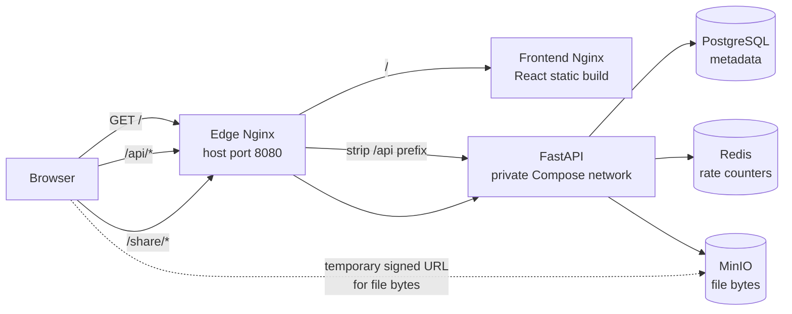

# FileVault Architecture and Code Walkthrough

This guide explains how the current V1 implementation is structured and what
its main functions do. It describes the code in this repository; it is not a
claim that the application has been deployed as a public cloud service.

For local setup, environment variables, and the short API reference, start with
the [README](../README.md).

## 1. System shape

FileVault is a **modular monolith**: one FastAPI application contains the
account, file, upload, download, and sharing features. The other Compose
containers are supporting infrastructure, not separate FileVault application
services.



The source divides responsibilities into these layers:

```text
HTTP request
    ↓
FastAPI router                 app/routers/
    ↓
Dependency wiring              app/dependencies.py
    ↓
Service / business workflow    app/services/ and app/service.py
    ├── Repository interface    app/repositories/*_repository.py
    │       ↓
    │   PostgreSQL adapter      app/repositories/postgres_*.py
    └── Storage interface       app/storage/base.py
            ↓
        MinIO adapter           app/storage/minio_storage.py
```

Routers translate HTTP details into service calls and HTTP responses. Services
apply ownership and workflow rules. Repositories persist relational records;
the storage adapter handles file bytes. This separation lets tests replace
PostgreSQL, Redis, and MinIO with in-memory implementations.

## 2. Runtime services and network boundaries

| Service | Job | Reachability in the supplied Compose setup |
| --- | --- | --- |
| Edge Nginx | Single browser entry point, reverse proxy, upload-body limit, gzip, and response headers | `127.0.0.1:8080` |
| Frontend | Nginx serves the built React files | Compose network only |
| API | FastAPI app, migrations on startup, API routes | Compose network only |
| PostgreSQL | User, file, upload, chunk, and share metadata | Compose network only; named volume |
| Redis | Expiring request-rate counters | Compose network only; named volume |
| MinIO | S3-compatible object storage and presigned downloads | `127.0.0.1:9000` (S3 API) and `127.0.0.1:9001` (console); named volume |

Inside Compose, containers address each other by service name, such as
`postgres:5432`, `redis:6379`, and `minio:9000`. The browser does not call
PostgreSQL or Redis. It uses the edge proxy for the application and follows a
MinIO signed URL when downloading file bytes.

`nginx/default.conf` sends `/api/...` to FastAPI while removing the `/api`
prefix. It sends `/share/...` to the public share router without requiring a
JWT. Other paths are passed to the frontend container. The inner
`frontend/nginx.conf` serves static files and falls back to `index.html` for
the React application.

The loopback host bindings are intentionally suitable for a local demo, not
remote device access. A remote deployment needs a public HTTPS endpoint and a
reachable object-storage endpoint; setting only the frontend host does not
publish the API or stored files.

### Edge Nginx: how a browser request is routed

The outer proxy is configured in `nginx/default.conf`. Compose publishes its
container port 80 as host port 8080 on `127.0.0.1`. Nginx is the normal browser
entry point for the UI and API; its upstream names `api` and `frontend` resolve
through Docker Compose's private service network.

For each request, Nginx checks an exact location first, then the longest
matching prefix, then matching regular-expression locations, and finally the
`/` fallback. The routes are:

| Incoming browser path | Nginx rule | Upstream request |
| --- | --- | --- |
| `/api` | Exact `location = /api` | `308` redirect to `/api/`, preserving the method. |
| `/api/auth/me` | Prefix `location /api/` | `http://api:8000/auth/me`; the trailing slash on `proxy_pass ...:8000/` replaces the matched `/api/` prefix with `/`. |
| `/share/<token>` | Prefix `location /share/` | `http://api:8000/share/<token>`; the matching prefix is replaced with the same `/share/` path. |
| `/files/...`, `/auth/...`, `/uploads/...` | Regex `location ~ ^/(auth\|files\|uploads)/` | FastAPI receives the original path because `proxy_pass` has no URI suffix. |
| `/docs`, `/redoc`, `/openapi.json`, `/health` | Regex `location ~ ^/(docs\|redoc\|openapi\.json\|health)$` | FastAPI receives the exact path. |
| `/`, `/assets/...`, or another frontend path | Fallback `location /` | `http://frontend:80` with the original path. |

The frontend uses `/api` as a relative API base. In this local setup, the
browser calls `http://localhost:8080/api/...`; it does not need to know the
internal `api:8000` container address. The public share route deliberately
does not require the user's JWT; the unguessable share token is the capability.

The API proxy forwards the original `Host`, client address, and forwarded
protocol information. `X-Real-IP` and `X-Forwarded-For` also provide the
client address; the login limiter specifically uses `X-Real-IP` as its
identity when present. The API proxy uses HTTP/1.1 and allows up to 300
seconds to read or send request data for longer uploads. The share route
forwards host and client-address headers; the
documentation/health route forwards the host.

Server-wide directives provide additional behavior:

- `client_max_body_size 1g` rejects an individual HTTP request body larger
  than 1 GiB at Nginx. This proxy limit is not a promise that every file up to
  that size is supported end-to-end; application, memory, storage, timeout,
  and hosting limits also apply.
- `server_tokens off` avoids disclosing the Nginx version in its server
  identification response.
- Gzip compresses eligible textual responses of at least 1024 bytes. It does
  not shrink uploaded bodies and rarely helps already-compressed files such as
  ZIP or JPEG.
- Response headers disable MIME sniffing and framing, restrict referrer
  details, and disable camera, microphone, and geolocation permissions. These
  are baseline browser policies, not a complete production security policy:
  this config does not itself configure TLS or a Content Security Policy.

### Frontend Nginx: static files and React routes

`frontend/nginx.conf` belongs to a different container from the edge proxy.
The frontend Dockerfile first runs Vite's production build, then copies `dist/`
into the official Nginx image at `/usr/share/nginx/html`. The Nginx `root`
points there and `index index.html` selects the SPA entry document.
`try_files $uri $uri/ /index.html` serves an existing built asset; if the path
does not exist as a file (for example, a React client-side route), it returns
`index.html` and lets React render the route in the browser. Frontend Nginx
does not route API calls to FastAPI; the **outer** Nginx does that.

### Example request journeys

**Opening the dashboard:** The browser requests `/` from host port 8080. Edge
Nginx sends it to `frontend:80`, whose Nginx returns `index.html`. The page
loads `/assets/...` through the same edge-to-frontend route, where actual
bundled files are served from `dist/`.

**Loading a private file list:** React calls `GET /api/files/?page=1...` on
the same origin with the JWT authorization header. Edge Nginx removes `/api/`,
so FastAPI receives `GET /files/?page=1...`. FastAPI authenticates the user,
queries owner-scoped PostgreSQL metadata, and returns JSON through Nginx.

**Downloading file bytes:** React calls `/api/files/<id>/download`; Nginx
removes `/api` and sends the request to FastAPI. FastAPI checks ownership and
returns a short-lived signed URL. The browser then fetches that URL directly
from MinIO, bypassing both Nginx and FastAPI for the file-byte transfer. The
browser must be able to reach the endpoint embedded in the signed URL.

## 3. Data model and ownership

The SQLModel table definitions are in `app/models.py`.

| Model | Meaning | Important fields |
| --- | --- | --- |
| `User` | An account | `email`, `hashed_password`, `created_at` |
| `File` | A stored file's metadata, not its bytes | `filename`, `object_key`, `size`, `content_type`, `owner_id`, `status` |
| `UploadSession` | A multipart upload workflow | Public UUID `upload_id`, `owner_id`, `filename`, final `object_key`, expected and received chunk counts, `status` |
| `Chunk` | One uploaded part of a session | Session database ID, 1-based `chunk_number`, byte `size`, temporary `object_key` |
| `ShareLink` | A public download capability | SHA-256 `token_hash`, file/owner IDs, expiry, download count/limit, revoked flag |

`File.owner_id` links a file to its account. Each private file route resolves
the bearer token to a user and checks that the file's `owner_id` matches that
user before returning metadata, creating a download URL, or deleting it.
Repository queries for listings also filter by owner.

The original share token is returned to the owner once when a link is created.
Only its SHA-256 hash is saved. A share-link URL is therefore a bearer
capability: anyone who obtains the unexpired, unrevoked URL may request a
download within its configured limit.

Alembic owns schema changes. `app/alembic/env.py` imports SQLModel metadata and
configures the database URL; the API container runs `alembic upgrade head`
before starting Uvicorn. Individual revision files define `upgrade()` and
`downgrade()` operations. For a new schema change, add a migration rather than
relying on development-time table creation.

## 4. API startup and dependency wiring

### `app/main.py`

- Constructs the FastAPI `app`, its title/description/OpenAPI tags, and version.
- Defines `health()` at `GET /health` for a lightweight liveness response.
- Mounts the authentication router under `/auth`, the file router under
  `/files`, the upload router under `/uploads`, and the public share router
  under `/share`.

### `app/config.py` and `app/db.py`

- `config.py` reads runtime configuration from environment variables. It
  contains names and defaults, not production secret values. The API needs a
  database URL and JWT/storage credentials to perform its work.
- `db.py` creates the SQLAlchemy engine from `DATABASE_URL`.
  `get_session()` yields a SQLModel `Session` for a request and closes it when
  the request is finished.

### `app/dependencies.py`

FastAPI dependency providers build the objects routers need for a request:

- `get_current_user()` decodes the bearer JWT, reads its `sub` claim as the
  account email, looks up the user, and returns `401` when the token/account is
  invalid.
- `get_storage()` constructs `MinioStorage` from the configured endpoint and
  credentials. It is the active storage adapter in this Compose app.
- `get_file_repository()`, `get_upload_session_repository()`,
  `get_chunk_repository()`, and `get_share_repository()` bind request-scoped
  database sessions to their PostgreSQL repository implementations.
- `get_upload_service()`, `get_upload_session_service()`,
  `get_chunk_service()`, `get_complete_upload_service()`,
  `get_download_service()`, and `get_share_service()` assemble business
  services from those repositories and storage.
- `get_rate_limiter()` creates and caches a Redis client-backed limiter.

The abstract `LocalStrorage` adapter exists in `app/storage/local.py`, but
`get_storage()` currently selects MinIO. The local adapter is not a second
Compose service or the active production-like path.

### HTTP handler map

The endpoint handlers are deliberately thin: they parse HTTP inputs, obtain
dependencies, call service/domain code, and translate expected exceptions.

| Handler | Route | Main work |
| --- | --- | --- |
| `register()` | `POST /auth/register` | Validate request schema and create an account. |
| `login()` | `POST /auth/login` | Apply IP rate limit, verify credentials, issue a JWT. |
| `get_me()` | `GET /auth/me` | Return the authenticated user's public profile. |
| `list_files()` | `GET /files/` | Return an owner-scoped file page; validates sort and page inputs. |
| `upload_file()` | `POST /files/upload` | Accept direct multipart upload and return the saved file ID. |
| `get_file()` | `GET /files/{file_id}` | Return metadata after checking ownership. |
| `download_file()` | `GET /files/{file_id}/download` | Return a short-lived private download URL. |
| `delete_file()` | `DELETE /files/{file_id}` | Check ownership and delete the object and metadata. |
| `create_share()` | `POST /files/{file_id}/share` | Create an owner-controlled public link. |
| `list_shares()` | `GET /files/{file_id}/shares` | Return the owner's share-link status without exposing tokens. |
| `revoke_share()` | `DELETE /files/{file_id}/share/{share_id}` | Revoke a share link scoped to its owner and file. |
| `download_shared_file()` | `GET /share/{token}` | Publicly validate the share and redirect to signed storage URL. |
| `initiate_upload()` | `POST /uploads/initiate` | Apply initiation limit and create a user-owned upload session. |
| `upload_chunk()` | `POST /uploads/{upload_id}/chunks/{chunk_number}` | Apply chunk limit and store one validated part. |
| `complete_upload()` | `POST /uploads/{upload_id}/complete` | Assemble uploaded parts and create final file metadata. |

## 5. Authentication flow

Authentication code lives in `app/routers/auth.py`, `app/service.py`,
`app/security.py`, and `app/dependencies.py`.

1. `POST /auth/register` validates the JSON body with `UserCreate`, then calls
   `create_user()`.
2. `create_user()` checks for an existing email, hashes the password using the
   Argon2 `CryptContext`, writes a `User`, commits, and refreshes the record.
   The raw password is not stored.
3. `POST /auth/login` first asks Redis to count a login attempt for the caller
   IP. The endpoint accepts OAuth2 form fields named `username` (the email)
   and `password`.
4. `authenticate_user()` looks up the email and verifies the submitted
   password against the stored hash. On success, `create_access_token()`
   signs a JWT containing the email in `sub` and an `exp` timestamp.
5. Protected requests use `get_current_user()` to verify and decode the JWT
   and load the account. `GET /auth/me` returns its public `id` and `email`.

The frontend keeps the JWT in browser `localStorage` under
`filevault-token`, attaches it as a Bearer token to API calls, and removes it
when the user signs out. This is convenient for this portfolio UI, but
JavaScript-accessible storage is exposed to successful same-origin script
injection. A public production deployment should reconsider token storage and
add a deployment-specific web security review.

## 6. File upload and storage

### Object keys

`ObjectkeyGenerator.generate()` in `app/utils/object_key.py` builds a key with
the account ID, current date, a random UUID, and the original filename
extension, for example:

```text
users/<user-id>/<year>/<month>/<day>/<random-uuid>.<extension>
```

The client-visible filename is stored separately in PostgreSQL. The opaque
object key is used to address the bytes in storage.

### Direct upload API

`POST /files/upload` accepts one multipart file and calls
`UploadServices.upload()`:

1. Generate an object key.
2. Measure the file stream's length while restoring its cursor position.
3. Write the stream to the storage adapter.
4. Create a `File` metadata row with owner, original filename, content type,
   size, and object key.
5. If the operation raises, attempt to remove the just-written object before
   re-raising the error.

The dashboard does **not** use this endpoint for normal uploads; it uses the
chunk workflow below.

### Chunked upload API

The dashboard divides each selected file into sequential 5 MiB slices. The
browser reports percentage progress while sending those parts; it processes
selected files one at a time.

1. `POST /uploads/initiate` validates `filename` and `total_chunks`, checks the
   user's upload-initiation rate limit, and calls
   `UploadSessionService.initiate_upload()`. That service generates the final
   object key and saves an `INITIATED` session owned by the user.
2. `POST /uploads/{upload_id}/chunks/{chunk_number}` checks the per-user chunk
   rate limit and calls `ChunkService.upload_chunk()`. The service verifies
   that the UUID belongs to the current user and remains `INITIATED`, checks
   the 1-based chunk number is in range, and treats an already-recorded chunk
   number as already uploaded. Otherwise it stores the bytes under a temporary
   key and saves chunk metadata and size.
3. `POST /uploads/{upload_id}/complete` calls
   `CompleteUploadService.complete_upload()`. It verifies ownership/status and
   that the recorded chunk count matches the expected total, sorts chunks by
   number, copies their streams in order into a temporary file, and writes the
   assembled stream under the final object key.
4. It creates the final `File` metadata row, removes the temporary chunk
   objects and rows, and marks the upload session `COMPLETED`.

The server tracks upload sessions and individual parts, and a repeated chunk
request can avoid replacing an already-recorded part. **The current React
dashboard does not persist a session ID or completed-chunk map across page
reloads, and does not automatically resume an interrupted upload.** If the
page closes or the network fails mid-upload, the user may need to start a new
upload; abandoned sessions/chunks are not automatically expired or cleaned up
by a background worker in this V1.

### Storage adapter contract

`storageBackend` in `app/storage/base.py` defines `put`, `get`, `delete`,
`exists`, and `generate_download_url`. The application services depend on
this contract rather than the MinIO SDK directly.

`MinioStorage` implements it with the MinIO Python client:

- `put()` determines stream length and sends bytes to the configured bucket.
- `get()` returns an object stream.
- `delete()` removes an object.
- `exists()` checks object metadata.
- `generate_download_url()` signs a time-limited GET URL and requests an
  attachment disposition containing the original UTF-8 filename.

File bytes live in MinIO; PostgreSQL stores the key and searchable metadata.
The two writes are not one distributed transaction. A failure between object
storage and database operations can leave an orphan object or a metadata row
that needs operational repair; production systems commonly add reconciliation
and lifecycle cleanup.

## 7. Listing, private download, and deletion

- `GET /files/` accepts page/page size, optional filename search, an allowlisted
  `sort_by` (`filename`, `size`, `created_at`), and sort direction. The router
  calculates the offset and total-pages response.
- `PostgresFileRepository.list_by_owner()` filters by owner, uses PostgreSQL
  `ILIKE` for case-insensitive substring search, maps the allowlisted sort
  column, and applies offset/limit. `count_by_owner()` calculates the
  matching total.
- `GET /files/{file_id}` returns metadata only after an owner check.
- `GET /files/{file_id}/download` calls `DownloadService.get_download_url()`.
  That service checks existence and ownership, then requests a five-minute
  presigned URL from storage. The browser follows the URL and downloads bytes
  from MinIO rather than streaming the object through FastAPI.
- `DELETE /files/{file_id}` checks ownership, deletes the stored object, then
  deletes its file metadata. Associated shares are configured to cascade with
  the file row in the database migration.

Because the presigned URL names the storage endpoint, it must be reachable by
the browser. Local Compose uses a loopback MinIO endpoint. A deployment on
another host must configure a public/reachable endpoint and appropriate
storage networking and CORS; otherwise the API can issue a URL that clients
cannot use.

### Repository persistence methods

The repository interfaces define operations used by services; the PostgreSQL
classes implement those operations with SQLModel sessions.

| Adapter | Methods and behavior |
| --- | --- |
| `PostgresFileRepository` | `create()` inserts and refreshes a file row; `get()` loads by file ID; `delete()` removes the row; `list_by_owner()` filters, searches, orders, and pages; `count_by_owner()` counts matching owner-scoped rows. |
| `PostgresUploadSessionRepository` | `create()` inserts a session; `get_by_upload_id()` resolves the public UUID; `update()` persists state/count changes; `delete()` removes a session. |
| `PostgressChunkRepository` | `create()` stores one part record; `get_chunk()` looks up one session/number pair; `list_chunk()` returns session parts; `delete()` removes a part record. |
| `PostgresShareRepository` | `create()` inserts a link; `get_by_token_hash()` resolves a token hash and can request a row lock; `get_for_owner()` scopes management by link/file/owner IDs; `list_for_file()` sorts links newest-first; `save()` persists revocation/count changes. |

## 8. Public share links

`ShareService` owns share policy; the file router handles HTTP status codes.

- `create()` checks file ownership, generates a cryptographically random
  token, hashes it with SHA-256 for persistence, computes expiry, and saves
  optional maximum-download policy.
- `list_for_file()` verifies the caller owns the file before listing its
  share records. It does not reconstruct tokens, which are not stored in
  recoverable form.
- `revoke()` loads the share by share ID, file ID, and owner ID, then marks it
  revoked.
- `get_download_url()` hashes the presented token, looks up the hash while
  requesting a row lock, checks revocation, expiry, and download limit,
  creates a five-minute signed URL, increments the download count, and saves.

`GET /share/{token}` is public and redirects to the signed object URL. Expired
or exhausted links return `410`; unknown or revoked links return `404`.
Revocation prevents new signed URLs, but it cannot invalidate a signed URL
already issued; that URL can remain usable until its short expiry.
`SHARE_PUBLIC_BASE_URL` controls the origin returned when a share is created.
Its local default is for local demonstrations and must be changed for a
deployment. The stored download count increments when the server successfully
validates the share and issues a signed URL; it does not prove that the
recipient completed downloading all bytes.

## 9. Redis request limits

`RateLimiter.consume()` runs a Lua script that increments a Redis key and sets
its expiry when the counter is first created. The key includes a scope
(`login`, `upload-initiate`, or `upload-chunk`) and caller identity. This
increment/expiry operation is atomic so concurrent requests use the same
counter window.

Configured per-minute limits are read from `LOGIN_RATE_LIMIT`,
`UPLOAD_RATE_LIMIT`, and `CHUNK_RATE_LIMIT`. A count above the limit becomes
HTTP `429` with `Retry-After`. Redis errors become HTTP `503`: the relevant
routes fail closed rather than silently running without the configured limit.

## 10. Frontend functions

The React application is in `frontend/src/main.jsx`.
Vite builds it into the static assets served by the frontend Nginx container.
`frontend/package-lock.json` makes dependency installation reproducible.
`frontend/package.json` pins Vite's transitive Rollup dependency to `4.59.0`:
the previously resolved `4.64.2` stalled during production tree-shaking, while
`4.59.0` completes the optimized build and passes the current npm audit.

| Function/component | Responsibility |
| --- | --- |
| `api(path, token, options)` | Sends same-origin requests under `/api`, attaches the bearer token when present, parses JSON, and throws an error using the API detail or HTTP status. |
| `formatBytes(value)` | Formats byte counts for the file table. |
| `AuthScreen` / `submit()` | Switches between login/register, posts registration JSON when needed, then submits login as URL-encoded OAuth2 form data. |
| `Dashboard` | Owns account/file/search/sort/page/upload/share UI state and renders the authenticated view. |
| `loadFiles()` | Requests one page with current search and sort state and updates rows and totals. |
| `uploadFiles()` | Splits selected files into 5 MiB chunks, initiates sessions, uploads sequential chunks, updates progress, completes each session, then reloads the list. |
| `download(file)` | Requests a private download URL and navigates the browser to it. |
| `remove(file)` | Asks for confirmation, deletes the file, and reloads the current page. |
| `openShares(file)` | Opens share management for a file and loads existing link status. |
| `createShare(event)` | Creates a link with chosen expiry/download cap, displays its returned URL, then refreshes status. |
| `revokeShare(shareId)` | Revokes a selected active link and refreshes share status. |
| `App`, `login()`, `logout()` | Reads the existing token from local storage, stores it on login, and removes it on logout. |

The dashboard's progress is a client-side byte-count calculation. The upload
requests are sequential, and there is no retry/backoff UI or persisted
cross-refresh resume state in the current implementation.

## 11. Error translation

Services use domain exceptions where workflows need to distinguish failures.
Routers translate expected conditions to HTTP responses:

| Condition | Typical response |
| --- | --- |
| Invalid request fields/query values | `422` from FastAPI/Pydantic |
| Invalid or expired JWT | `401` |
| File exists but belongs to another user | `403` |
| Missing file/upload/share | `404` |
| Chunk number or incomplete upload | `400` |
| Expired or download-exhausted share | `410` |
| Rate limit exceeded | `429` plus `Retry-After` |
| Redis or object storage unavailable | `503` |

An unexpected programming or database error is not meant to be disguised as a
successful response; it should surface as an error and be investigated in
service logs.

## 12. Tests and confidence boundaries

`app/tests/test_api.py` exercises HTTP behavior using FastAPI `TestClient`.
`app/tests/conftest.py` supplies an isolated SQLite database, an in-memory
storage adapter, and an in-memory Redis substitute, then overrides dependency
providers. This makes the backend tests repeatable without running the Compose
services.

Covered paths include registration/login/current-user, invalid tokens,
ownership checks, direct and chunked upload, incomplete uploads, search/sort/
pagination, share limits/expiry/revocation, rate-limit handling, storage
errors, and filename-aware signed downloads.

These tests establish behavior with test doubles; they do not prove that a
live internet deployment, production MinIO permissions, remote CORS, Vercel
runtime, backups, or real cross-device transfers are configured correctly.
A local browser smoke check has also covered registration/sign-in, a small
chunked upload, dashboard listing, share creation/revocation, and file
deletion. It does not certify large-file/network interruption handling or a
remote deployment.

### Manual acceptance checklist

Run this after `docker compose up --build` and open
<http://localhost:8080>:

1. Register with a test email and sign in. Sign out and sign in again.
2. Upload a small text file, then a file larger than 5 MiB. Watch progress and
   confirm both appear in the dashboard.
3. Search for each filename, change sorting, and try paging after adding more
   than ten files.
4. Download a file and verify it opens with its original filename/content.
5. Create a share link with a one-download limit. Open it in a private browser
   window once; a second attempt should report that the limit was reached.
6. Create another link, revoke it, and confirm it no longer grants a new
   download.
7. Delete a test file, confirm it disappears, then sign out.
8. Register a second account and confirm it cannot access the first account's
   private file IDs.

Use disposable accounts/files for this checklist. Do not upload private
documents to a public deployment or put live credentials in screenshots.
Testing from a different device requires the API and object-storage endpoints
to be deployed and reachable; the local `localhost` configuration is not
cross-device hosting.

## 13. What a remote deployment additionally needs

The Compose configuration is a local development/demo deployment. To make
accounts and files available from another device, all required services—not
just the React page—must be deployed and reachable:

1. Deploy the FastAPI application on a host that supports its persistent HTTP
   process and long-running/multipart requests.
2. Configure a durable PostgreSQL database, Redis service, and S3-compatible
   object store with persistent data and access policies.
3. Set production environment variables, including strong independent
   secrets, database/Redis/storage endpoints, `MINIO_PUBLIC_ENDPOINT`, and
   `SHARE_PUBLIC_BASE_URL`. Keep secret values in the host's secret manager,
   not in Vite variables or committed files.
4. Configure HTTPS, domain routing, upload/body and request timeouts,
   authentication boundaries, backups, storage CORS if needed, and monitoring.
5. The frontend currently calls the relative path `/api`. If frontend and API
   are deployed on separate origins (for example, static frontend hosting with
   an independently hosted API), provide a same-origin rewrite/proxy or change
   the frontend API base and configure the API's CORS policy. The share links
   and signed download URLs must also use origins reachable by the recipient.

Hosting the static frontend on Vercel alone does not deploy FastAPI, PostgreSQL,
Redis, or MinIO and does not expose the local Compose data. This repository
does not include a verified Vercel deployment configuration.

## 14. Local lifecycle and data safety

- `docker compose up --build` builds and starts the local stack.
- `docker compose down` stops/removes the containers but keeps the named
  PostgreSQL, Redis, and MinIO volumes.
- `docker compose down -v` removes those volumes and destroys their local
  contents; use only when intentionally resetting local application data.
- Root `.env` and `app/.env` are local secret files and must not be committed.
  The `.env.example` files are templates.
- Local object data written under `app/storage_data/`, frontend dependencies,
  build outputs, virtual environments, and caches are generated/local state,
  not application source.

See the [README security and configuration sections](../README.md#secrets-and-files-safe-to-push)
before publishing or deploying this project.

## 15. Codebase module and file map

This is a curated map of the files that implement, configure, test, or explain
the application. Generated dependencies, build output, caches, and local
environment files are intentionally not source modules.

### Backend: `app/`

| File or directory | Responsibility |
| --- | --- |
| `app/main.py` | Creates the FastAPI application, exposes `/health`, and mounts the routers. |
| `app/config.py` | Reads settings from environment variables; secret values are supplied outside source code. |
| `app/db.py` | Builds the database engine and yields request-scoped SQLModel sessions. |
| `app/models.py` | SQLModel table entities for users, files, upload sessions, chunks, and share links. |
| `app/schemas.py` | Pydantic/SQLModel request and response shapes, input validation, and API serialization. |
| `app/security.py` | Password hashing/verification and JWT creation/decoding helpers. |
| `app/service.py` | Account-level business operations used by authentication handlers. |
| `app/dependencies.py` | FastAPI dependency construction for current user, DB repositories, Redis limiter, storage, and services. |
| `app/routers/auth.py` | Registration, login, and current-user HTTP endpoints. |
| `app/routers/files.py` | File listing, direct upload, metadata, download URL, deletion, share management, and public share-download endpoints. Both private and public routers are declared here. |
| `app/routers/uploads.py` | Multipart-upload session initiation, chunk receipt, and completion endpoints. |
| `app/services/upload.py` | Direct file storage and metadata operations. |
| `app/services/upload_session.py` | Creation and lookup of multipart upload sessions. |
| `app/services/chunk_service.py` | Per-chunk validation, persistence, and upload to temporary object storage. |
| `app/services/complete_upload.py` | Checks that all required chunks exist, assembles/finalizes the object, records file metadata, and cleans up parts. |
| `app/services/download_service.py` | Owner-checked private file lookup and presigned download URL generation. |
| `app/services/share_service.py` | Share creation/listing/revocation and public token, expiration, count-limit, and signed-URL behavior. |
| `app/services/rate_limiter.py` | Redis-backed atomic request counters and rate-limit exceptions. |
| `app/repositories/file_repository.py` | Abstract file persistence contract. |
| `app/repositories/postgres_file_repository.py` | PostgreSQL implementation of file metadata persistence and owner-scoped queries. |
| `app/repositories/upload_session_repository.py` | Abstract upload-session persistence contract. |
| `app/repositories/postgres_upload_session_repository.py` | PostgreSQL implementation for upload-session records. |
| `app/repositories/chunk_repositiry.py` | Abstract chunk persistence contract; the existing filename contains this spelling. |
| `app/repositories/postgres_chunk_repository.py` | PostgreSQL implementation for chunk records. |
| `app/repositories/share_repository.py` | Abstract share-link persistence contract. |
| `app/repositories/postgres_share_repository.py` | PostgreSQL implementation for share links and token-hash lookups. |
| `app/repositories/__init__.py`, `app/storage/__init__.py`, `app/routers/__init__.py`, `app/tests/__init__.py` | Package markers for the corresponding Python packages. |
| `app/storage/base.py` | Contract implemented by object-storage adapters. |
| `app/storage/minio_storage.py` | Active S3-compatible MinIO adapter for file bytes, temporary parts, and signed URLs. |
| `app/storage/local.py` | Local-filesystem adapter retained as an alternate implementation; current dependency wiring chooses MinIO. |
| `app/storage/exceptions.py` | Storage-domain exceptions that keep provider-specific failures out of route logic. |
| `app/utils/object_key.py` | Generates unique object keys so user-provided filenames are not used directly as storage paths. |
| `app/alembic.ini` | Alembic command configuration. |
| `app/alembic/env.py` | Connects Alembic to configured database settings and SQLModel metadata. |
| `app/alembic/versions/d1c8a4024df6_initial_commit.py` | Initial `user` and `file` tables. |
| `app/alembic/versions/d917b45fb69f_add_dile_metadata_model.py` | Adds object key, content type, status, and an object-key index to file metadata. |
| `app/alembic/versions/059d34051d5f_add_upload_session_model.py` | Adds multipart upload-session records. |
| `app/alembic/versions/3bb30d82f442_chunk_model.py` | Adds persisted chunk records. |
| `app/alembic/versions/07774c1c45b6_add_object_key_to_chunk.py` | Adds each chunk's object key and corrects the chunk-number column. |
| `app/alembic/versions/605aec881c94_add_share_links.py` | Adds share links, foreign keys, and indexes for tokens/files/owners. |
| `app/tests/conftest.py` | Shared test fixtures and dependency overrides, including in-memory/fake infrastructure. |
| `app/tests/test_api.py` | API and workflow tests for authentication, ownership, file operations, multipart upload, sharing, and rate limiting. |
| `app/requirements.txt` | Python runtime and test dependencies for the backend. |
| `app/pytest.ini` | Pytest discovery and Python import-path settings. |
| `app/healthcheck.py` | Container health probe that requests the API health endpoint. |
| `app/Dockerfile` | Builds the Python API image and its runtime environment. |
| `app/.dockerignore` | Excludes local/generated files from the backend image build context. |
| `app/.gitignore` | Excludes backend-local environment files, storage data, caches, and other generated state from Git. |
| `app/.env.example` | Safe backend environment-variable template; replace placeholders locally and never put live credentials in it. |

Responsibility is split between HTTP routes and the listed business services:
upload-session/chunk services enforce multipart state and ordering; completion
verifies the submitted parts and creates final metadata; the download service
creates private signed URLs; the share service validates
expiration/revocation/limits and creates public signed URLs; and the rate
limiter uses Redis atomic counters with expiry. The PostgreSQL repositories
implement the storage contracts expected by those services.

### Frontend: `frontend/`

| File or directory | Responsibility |
| --- | --- |
| `frontend/src/main.jsx` | React entry point and dashboard application, including authentication state, file actions, and upload flow. The current UI is in this file rather than a separate `App.jsx`. |
| `frontend/src/styles.css` | Layout, responsive behavior, and component styling. |
| `frontend/index.html` | Vite HTML entry point and browser metadata. |
| `frontend/vite.config.js` | Vite development/build configuration. |
| `frontend/package.json` | Frontend scripts and direct dependencies, including the Rollup version override. |
| `frontend/package-lock.json` | Locked dependency tree for repeatable npm installs. |
| `frontend/Dockerfile` | Multi-stage frontend build: npm/Vite compilation followed by static asset serving. |
| `frontend/nginx.conf` | Inner Nginx static-file and React SPA fallback configuration; distinct from `nginx/default.conf`. |
| `frontend/.dockerignore` | Avoids copying local dependencies, build output, and environment files into the image build context. |

### Root infrastructure and documentation

| File or directory | Responsibility |
| --- | --- |
| `docker-compose.yml` | Defines the six services, private network, environment wiring, health checks, startup dependencies, loopback-only host ports, and persistent named volumes. |
| `nginx/default.conf` | **Edge** Nginx routing from the host-facing port to the frontend and API, with upload limit, timeouts, compression, and baseline response headers. |
| `.env.example` | Safe template for Compose-level settings; does not contain the actual local secret values. |
| `.gitignore` | Root exclusions for secrets, local storage, dependencies, caches, and generated files. |
| `README.md` | Project overview, quick start, feature list, configuration/security guidance, and links to deeper documentation. |
| `docs/ARCHITECTURE.md` | This guide: architecture, request/data flows, module responsibilities, known boundaries, and acceptance checklist. |
| `docs/screenshots/dashboard-preview.svg` | Illustrative dashboard preview asset. |
| `.github/workflows/tests.yml` | GitHub Actions workflow for repository checks. |

### Why there are two Nginx configurations

The frontend image's Nginx is an internal static web server: it serves the
compiled React assets and provides the SPA fallback. The separate root
`nginx/default.conf` is the edge reverse proxy: it is published to the host
and chooses whether a request goes to the frontend or FastAPI. Keeping those
roles separate makes the frontend image independently serve its build while
the edge container provides one browser-facing route for both UI and API.
